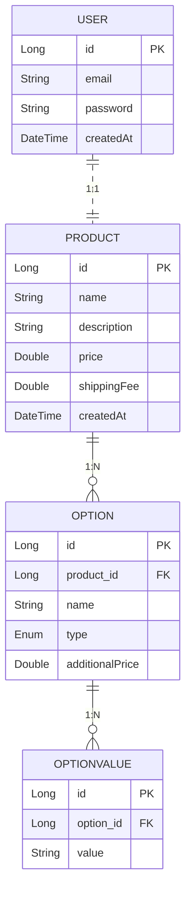

# ERD 설계

User: 사용자 정보를 저장, 회원 가입된 사용자 계정의 기본 정보를 관리 
Product: 상품 정보를 저장, 판매 가능한 각 상품에 대한 기본 데이터를 포함합 
Option: 상품의 선택 옵션을 저장, 옵션은 입력형(INOUT) 또는 선택형(SELECT)으로 나뉘며, 개별 상품과 연결 
OptionValue: 선택형(SELECT) 옵션의 구체적인 값 목록을 저장, 각 옵션에 연결된 여러 선택지를 표현 

