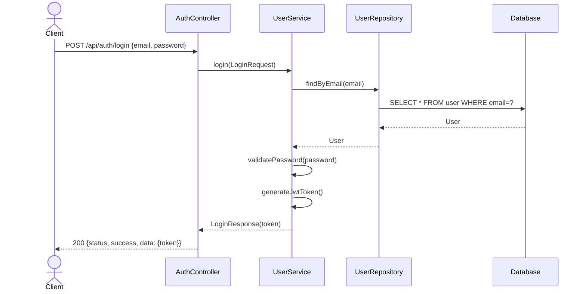
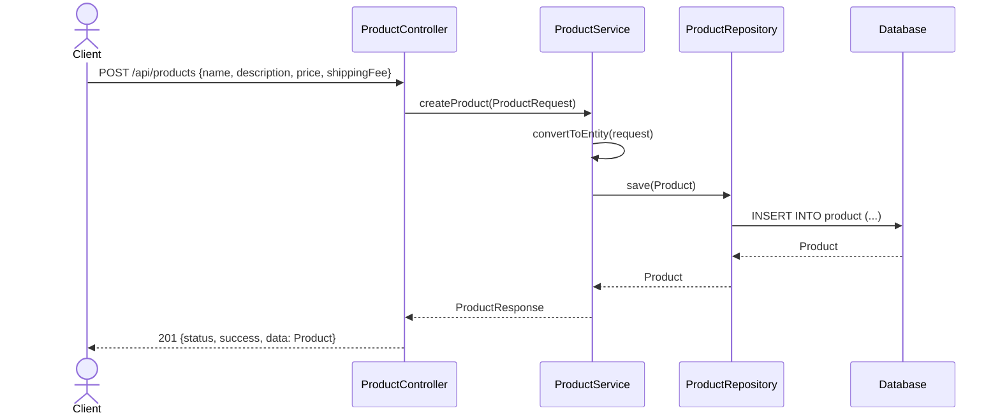
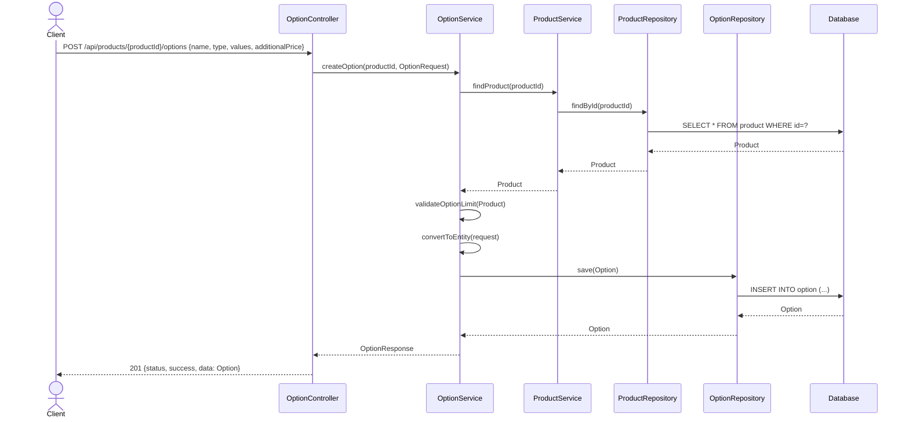

# 상품 및 옵션 관리 API 시퀀스 다이어그램

## 1. 로그인 API (POST /api/auth/login)
- UserService가 UserRepository를 통해 사용자 조회 후 비밀번호 검증, JWT 생성.

## 2. 상품 등록 API (POST /api/products)
- ProductService가 DTO를 엔티티로 변환, ProductRepository로 DB 저장.

## 3. 옵션 등록 API (POST /api/products/{productId}/options)
- OptionService가 ProductService를 통해 상품 조회, 옵션 제한(3개) 확인, OptionRepository로 저장.

